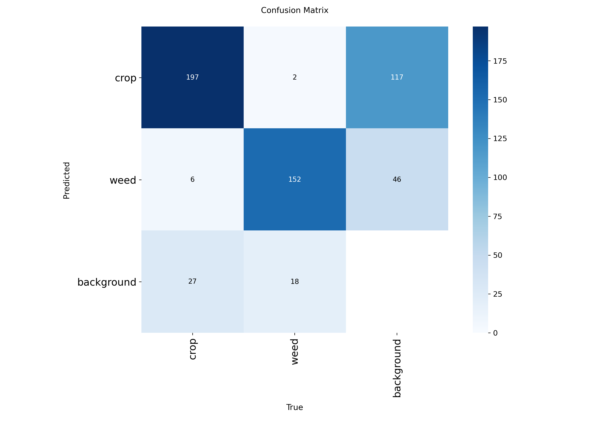

# Model Results – Crop and Weed Detection

This folder contains the training and evaluation results of the YOLOv8-based
Crop and Weed Detection model.

---

## 📊 Performance Metrics

| Metric | Value |
|------|------|
| Precision | 0.816 |
| Recall | 0.816 |
| mAP@50 | 0.876 |
| mAP@50–95 | 0.592 |

---

## 📈 Training Curves

### Loss Curves

---

## 🧪 Validation Results

### Confusion Matrix

---

## 📌 Notes
- Model trained for **50 epochs**
- Input image size: **512 × 512**
- Classes detected:
  - Crop
  - Weed
